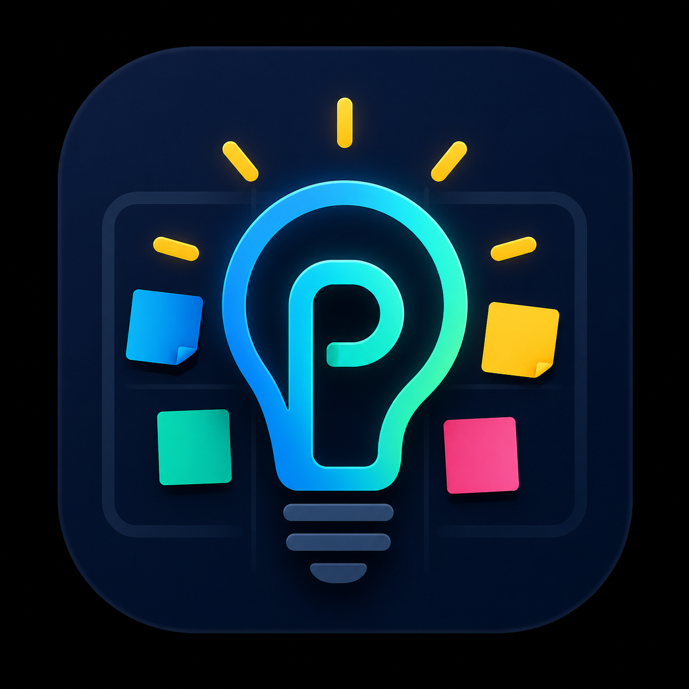

<p align="center">
  
</p>

<h1 align="center">PlanlaMa</h1>

<p align="center">
  A local-first visual planning board for focus, notes, tasks, and nested workspaces.
</p>

<p align="center">
  
  
  
</p>

<!--
Add a screenshot at assets/screenshot.png, then uncomment this block:


-->

## Overview

PlanlaMa is an ADHD-friendly desktop planning app built with Electron. It gives you a flexible visual workspace where tasks, notes, images, and nested boards can live together without forcing everything into a strict list or calendar.

The app is designed for quick daily planning, idea parking, and focus management. Everything is stored locally on your device.

## Features

- Visual board layout with draggable and resizable objects
- Sections for separating contexts such as Today, This week, and Ideas
- Post-it style cards with text, Markdown, to-do lists, and images
- Nested boards for breaking large areas into smaller workspaces
- Card status tracking: Next, Now, Waiting, and Done
- Local image import and pasted image support
- Separate object windows for focusing on one board or card
- English and Turkish interface support, with English as the default language
- Local JSON storage, no account or cloud service required

## Tech Stack

- Electron
- JavaScript
- HTML
- CSS
- electron-builder

## Getting Started

Install dependencies:

```bash
npm install
```

Run the app in development:

```bash
npm start
```

Build for macOS:

```bash
npm run dist:mac
```

Build for Windows:

```bash
npm run dist:win
```

## Data Storage

PlanlaMa stores planner data locally in Electron's `userData` directory as `planner-data.json`. Imported and pasted images are copied into a local `assets` directory next to the data file.

## Project Scripts

| Command | Description |
| --- | --- |
| `npm start` | Run the Electron app |
| `npm run icon` | Generate macOS icon assets |
| `npm run dist:mac` | Build macOS DMG and ZIP packages |
| `npm run dist:win` | Build Windows installer and portable packages |

## License

MIT License. See [LICENSE](LICENSE) for details.
